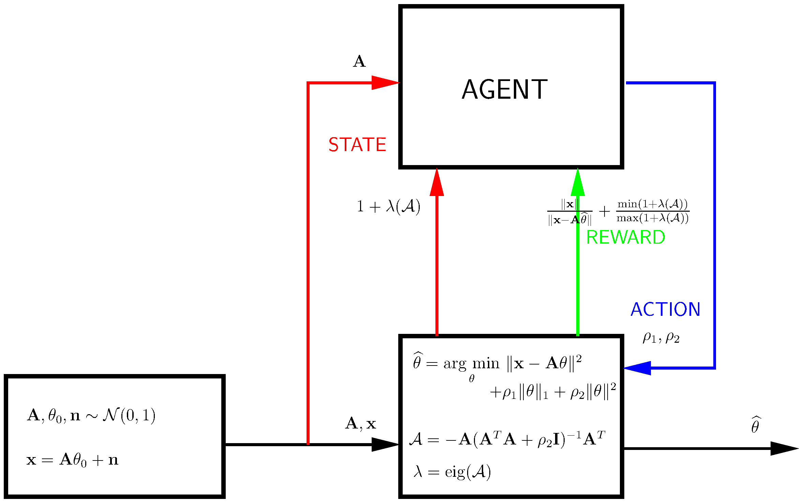

# Smart Calibration
Using reinforcement learning for hyperparameter tuning in calibration of radio telescopes, and in other data processing pipelines (like elastic net regerssion). Code to accompany the paper **Deep reinforcement learning for smart calibration of radio telescopes**.

RL agent code is based on [this code](https://github.com/philtabor/Youtube-Code-Repository.git).

Implemented in PyTorch, using openai.gym.
## Elastic net regression



Run ``` main_ddpg.py ``` or ``` main_td3.py ``` to use DDPG or TD3.

Files included are:

``` autograd_tools.py ```: utilities to calculate Jacobian, inverse Hessian-vector product etc.

``` enetenv.py ```: openai.gym environment

``` enet_td3.py  ```:  TD3 agent

``` enet_ddpg.py ```: DDPG agent

``` enet_eval.py ```: evaluation

``` lbfgsnew.py ```: LBFGS optimizer

``` main_ddpg.py ```: run this for DDPG

``` main_td3.py ```: run this for TD3

## Calibration

Additional packages: python-casacore, astropy, pyfits, openmpi

Simulation and Calibration software: [SAGECal](https://github.com/nlesc-dirac/sagecal)

Imaging software: [Excon](https://sourceforge.net/projects/exconimager/)


Run ``` main_ddpg.py ``` or ``` main_td3.py ``` to use DDPG or TD3. You can copy some example data from
[here](https://github.com/nlesc-dirac/sagecal/tree/master/test/Calibration).

Files included are:

``` calibration_tools.py ```: utility routines

``` simulate.py ```: generated sky models, systematic errors for data simulation 

``` calibenv.py ```: openai.gym environment

``` analysis.py ```: calculate influence function/map

``` calib_td3.py ```: TD3 agent

``` calib_ddpg.py ```: DDPG agent

``` lbfgsnew.py ```: LBFGS optimizer

``` main_ddpg.py ```: run this for DDPG

``` main_td3.py ```: run this for TD3

``` docal.sh ```: shell wrapper to run calibration

``` doinfluence.sh ```: shell wrapper to run influence mapping

``` dosimul.sh  ```: shell wrapper to run simulations

``` inspect_replaybuffer.py ```: inspect the replay buffer contents

The following scripts are for handling radio astronomical (MS) data

``` addcol.py ```: add new column to write data

``` changefreq.py ```: change observing frequency

``` readcorr.py ```: read data and output as text

``` writecorr.py ```: write text input and write to MS

``` addnoise.py  ```: add AWGN to data

``` calmean.sh ```: calculate mean image

``` doall.sh ```: wrapper to do simulation, calibration, and influence map generation
