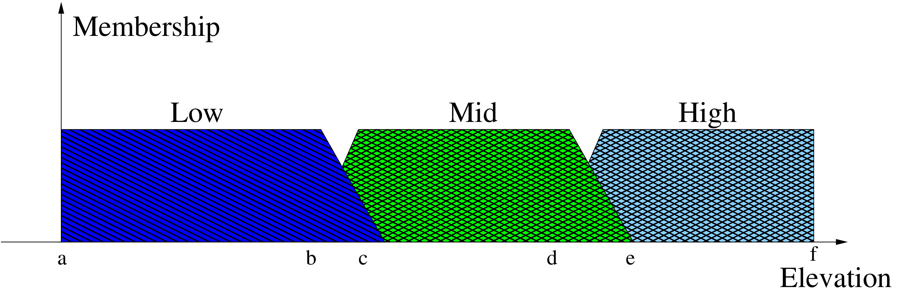

# An introduction to designing and using a fuzzy controller
This is a brief introduction on how to design a fuzzy controller for practical applications, and we will be using the demixing (outlier source removal) calibration as an example.

What is a fuzzy controller? There are many resources to find this out, say using a search engine or posing this question to an LLM. For brevity, we consider an intelligent agent that is designed to control a task without manual intervention a controller. If the task involves parameters that are not precise (or vague, or defined as a rule of thumb), then fuzzification can handle the impreciseness. Finally, the decision making process in the fuzzy controller can be broken down into many simple rules, hence understandable by humans, and yet complex enough to handle real tasks.

We feed several variables to the fuzzy controller as input and also can get back one (or more) variables as output. Both inputs and outputs are fuzzy variables, i.e., they have a certain level of uncertainty (uncertainty not due to measurement error, but the way it is defined). For example, when we say 'it is cold outside' what is the exact value of the temperature? The temperature can have a range of values for it to be 'cold outside'.

The fuzziness of any variable is represented by 'membership functions'. Each variable can have a valid range of values, and this range is divided into sub-ranges that cover the range, see the figure below. In the figure below, we have selected trapezoidal membership functions to cover the range for the variable 'elevation'. The range is *a* to *f* and this range is divided into three sets, *low*, *mid* and *high*. The three trapezoidal membership functions are defined by the intermediate values *b*,*c*,*d*, and *e* in the range *a* to *f*.

In this application, we have the following as input (antecedents), for each outlier (A-Team) source:

- Elevation: elevation of the outlier source.
- Separation: angular separation of the outlier source from the target.
- Flux: Log flux density (intrinsic) of the outlier source.
- Flux ratio: Flux density ratio between the outlier and the target sources.
- More?: will be added as the system develops.

We have one output (consequent):

- Priority: priority of the outlier source being selected for demixing.

Note that none of the antecedents or consequents are directly dependent on the data, they are in fact dependent on the meta-data. In the following table, we provide the nominal values *b*,...,*e* for each of the input and output fuzzy variables. The *Low*, *Mid* and *High* membership functions are defined by a trapezoid, with four values.

|  Variable | Range | Low | Mid | High|
|-----------|-------|-----|-----|-----|
|  Elevation   | -90 to 90  | -90, -90, -5, 5 | -5, 5, 50, 60    | 50, 60, 90, 90  |
|  Separation  | 0 to 180 |  0, 0, 10, 15 | 10, 15, 45, 50  | 45, 50, 180, 180 |
|  Log intensity | 0 to 100 | 0, 0, 1, 2 | 1, 2, 5, 10  | 5, 10, 100, 100 |
|  Intensity ratio  | 0 to 100 | 0, 0, 0.5, 1  | 1, 2, 5, 10  | 5, 10, 100, 100  |
|  Priority  |  0 to 100 | 0, 0, 40, 50 | 40, 50, 70, 75  | 70, 75, 100, 100 |

The relationships between the inputs and the outputs are defined by using fuzzy rules. There can be as many rules as possible and each rule can be simple for a human to formulate and understand. For example, we can say *IF* the separation is *Low*, *THEN* the priority is *High*. Conversely, *IF* the elevation is *Low*, *THEN* the priority is *Low*. We can combine more than one antecedent using logical operations and relate them (using the *IF* condition) to one or more consequents.

The complicated task in designing and tuning the fuzzy controller is determining the values *b*,...*e* to get the desired performance and accuracy. In order to do this, we use reinforcement learning.

The performance of the fuzzy controller is evaluated using simulated LOFAR observations (both LBA and HBA). In each observation, the fuzzy controller gives the priority of each outlier source, and the sources with *High* priority are used in demixing. The evaluation of this configuration is done using the Akaike information criterion (AIC). In this criterion, we evaluate the quality of the output data (after demixing) and also the cost that has to be incurred (in terms of the number of parameters or the degrees of freedom). See [this paper](https://arxiv.org/abs/2301.03933) for a more mathematical description of the evaluation.

Using the performance of the fuzzy controller in each simulated observation, we calculate a reward for training the reinforcement learning agent. The reinforcement learning agent will determine the values *b*,...,*e* for all inputs and outputs of the fuzzy controller. These fine-tunes values will be used in the final fuzzy controller.

In a purely data driven approach, we can directly use the Akaike information criterion for determining the best configuration to use (i.e., the best choice of outlier directions). The drawbacks of a data driven approach are many. First, for a large amount of data, a small amount of data need to be sampled to evaluate the AIC. Depending on what part of data are sampled, the outcome might be different from the correct result. Secondly, for *K* outlier directions, there are *2^K* possible configurations and evaluation of all possible configurations need substantial computing power.

After training the fuzzy controller, we can combine the data driven and the fuzzy controller based decisions, for example by weighting the outcome of each approach by taking the product of the priorities.

do 17 apr 2025 12:03:48 CEST
