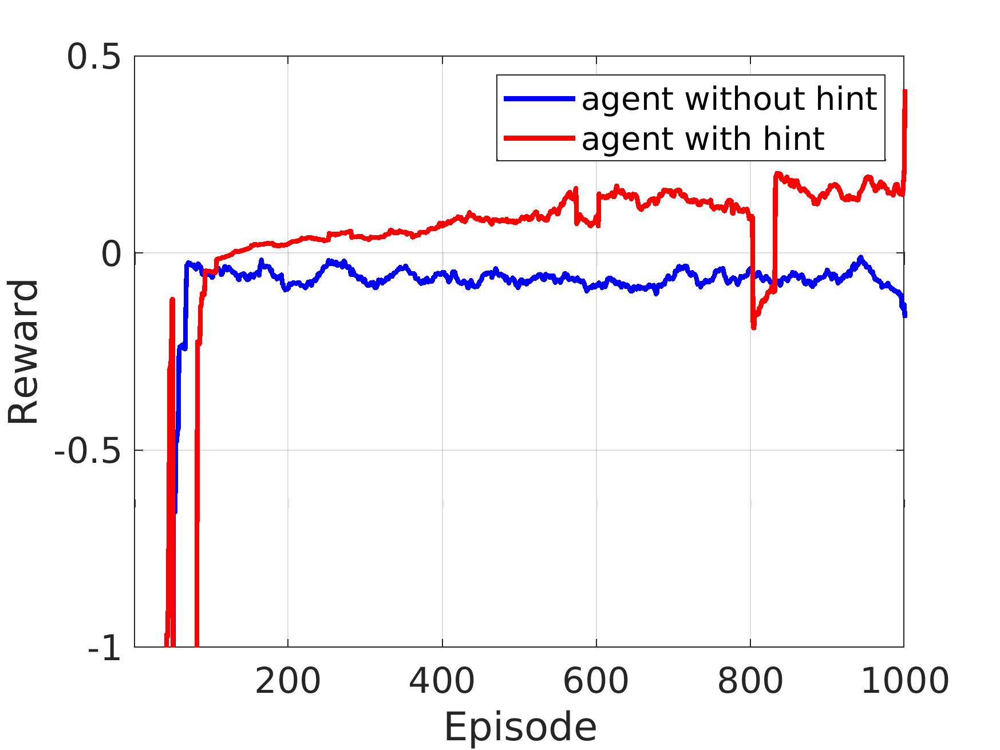

# Parameter tuning for multi-directional calibration
This directory includes files to train a SAC agent to select the directions to calibrate and additionally to select the maximum number of iterations to use in calibrationb. Selecting which directions to calibrate depends on the sources appearing in the sky, more directions means more computing but also means better reduction of interference towards the target observation. Increasing the number of iterations to use in calibration means more computational cost, so the less is better, but might give a poor end result.


* Run ``` main_sac.py ``` to train the agent. 
  ```
  python main_sac.py --seed 2 --iteration 1500 --use_hint
  ```

Run ``` evaluate_models.py ``` to evaluate trained models in terms of their performance.

The following image shows the performance of the agent trained without and with hints, clearly the agent trained with hint shows increase in reward indicating learning.


